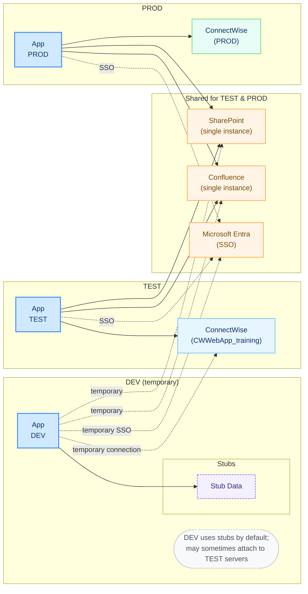

# Matrix Integration AI Foundations

[](./setup_guide.md)
[](https://www.python.org/downloads/)
[](https://nodejs.org/)
[](#)

Enterprise-grade AI infrastructure and applications designed to accelerate IT ticket resolution, enhance organizational visibility, and seamlessly manage AI models and agents. This project establishes the foundation for AI capability management, integrating securely with existing enterprise systems like ConnectWise, Confluence, SharePoint, and Microsoft Entra ID.

---

## 🌟 Key Capabilities & Modules

The project is composed of several critical systems working in tandem to deliver the core functionality:

### 1. Ticket Orchestrator

A full-stack web application designed for Level 1 and Level 2 support ticket assignment assistance.

* **Frontend (`ticket-orchestrator/frontend`)**: Built with React, providing an intuitive interface for managing ticket flows and AI-assisted resolutions.
* **Backend (`ticket-orchestrator/backend`)**: A robust FastAPI service that powers the orchestrator, interfaces with external APIs, and manages the business logic for ticket assignments.

### 2. Enterprise Data Collector (EDC)

A dedicated data gathering and processing engine (`edc/`) that synchronizes domain knowledge.

* Connects to **ConnectWise**, **Confluence**, and **SharePoint**.
* Maintains active and historical ticket mirrors.
* Generates and stores **vector embeddings** for similarity search and AI context augmentation.
* Processes the organization's **Skill Matrix** for intelligent ticket routing.

### 3. Telemetry & Observability

A comprehensive AI activity logging and monitoring pipeline using OpenTelemetry.

* **OTLP Receiver (`otlp_receiver/`)**: Custom OpenTelemetry collector configured to securely ingest telemetry data from all microservices.
* **Database (`matrixsql`)**: Utilizes Microsoft SQL Server to store deep metrics, application logs, and AI request traces.

### 4. Shared SDK & Utilities

* **MCP SDK (`mcp_sdk/`)**: Reusable Python code and foundations for Model Context Protocol (MCP) servers.
* **TotoDev Core (`totodev/`)**: Specialized utility libraries for centralized configuration, secret management, and cross-application infrastructure.

---

## 🏗️ Architecture & Environments

The platform is designed to run securely across Development, Test (TEST01), and Production (PROD01) environments, with isolated access to client systems based on the deployment tier.



---

## 🚀 Getting Started

The platform runs as a constellation of microservices managed primarily by Docker Compose.

### Prerequisites

* Docker & Docker Compose
* Python 3.11+
* Node.js 18+

### Setup Guide

For comprehensive, step-by-step instructions covering configuration, database initialization, and running services locally, please refer to the **[Setup Guide](setup_guide.md)**.

### Quick Start (Docker)

1. Clone the repository.
2. Create your environment configuration file: `config._THIS_IS_<YOURNAME>_ENV_.sh`
3. Load the configuration: `source config._THIS_IS_<YOURNAME>_ENV_.sh`
4. Spin up the infrastructure:
   ```bash
   docker compose up -d
   ```

---

## 🛠️ Technology Stack

| Component               | Technologies                                                         |
| ----------------------- | -------------------------------------------------------------------- |
| **Frontend**      | React, Webpack                                                       |
| **Backend API**   | Python 3.11+, FastAPI, Uvicorn, Pydantic                             |
| **AI / LLM**      | LangChain, OpenAI (GPT-4o, GPT-4o-mini)                              |
| **Database**      | Microsoft SQL Server (2022), SQLite                                  |
| **Observability** | OpenTelemetry (OTLP), FastAPI Instrumentation                        |
| **Integrations**  | ConnectWise API, Microsoft Entra SSO, SharePoint API, Confluence API |
| **DevOps**        | Docker, Docker Compose, GitHub Actions                               |

---

## 🔐 Security & Configuration

Security and environment segregation are handled securely through dynamic configurations:

* **`config.py`**: Centralizes global defaults and logic for DEV, STAGE, and PROD.
* **Environment Scripts**: Secrets and sensitive endpoint URLs are loaded dynamically via `config._THIS_IS_<ENV>_ENV_.sh` files which are properly `.gitignore`d to prevent leakage.
* **SSO**: Application authentication leverages robust Microsoft Entra ID integration.

---

*Developed by  WPBrigade for Matrix Integration.*
